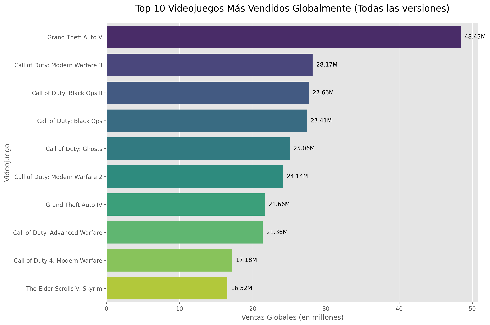
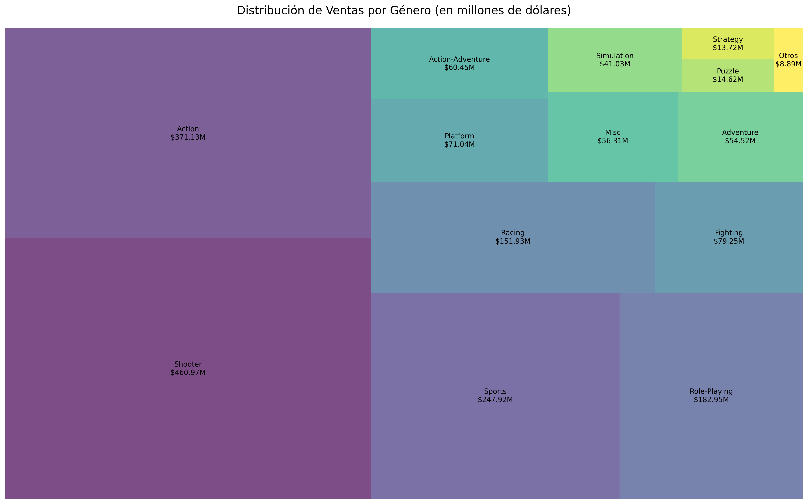
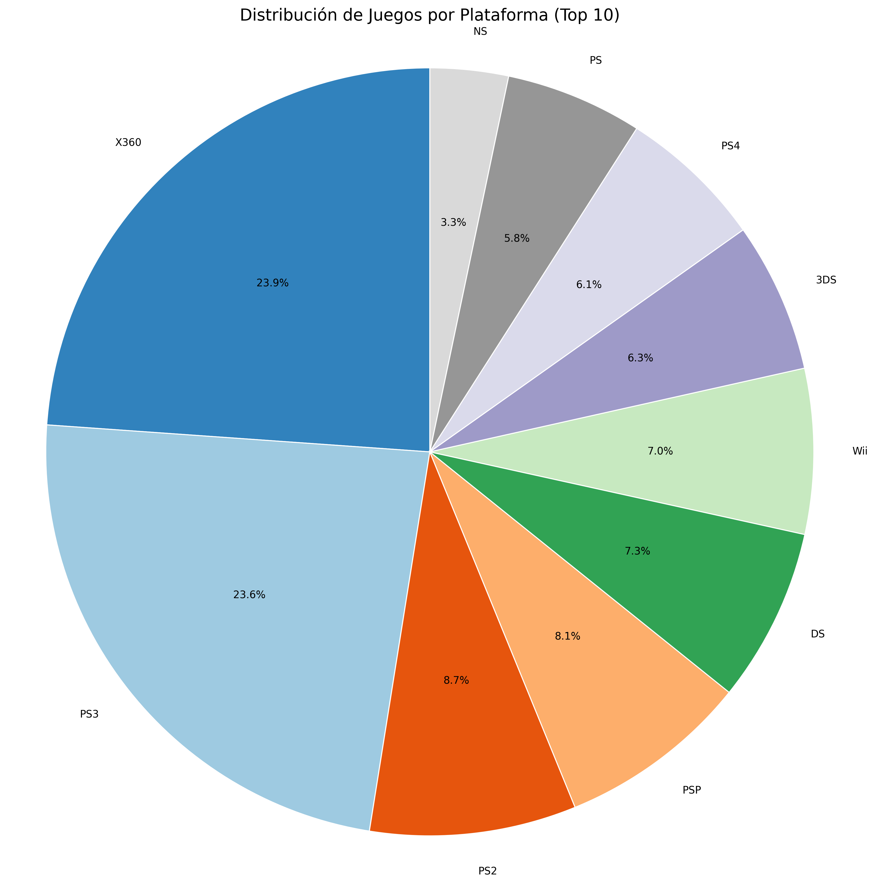
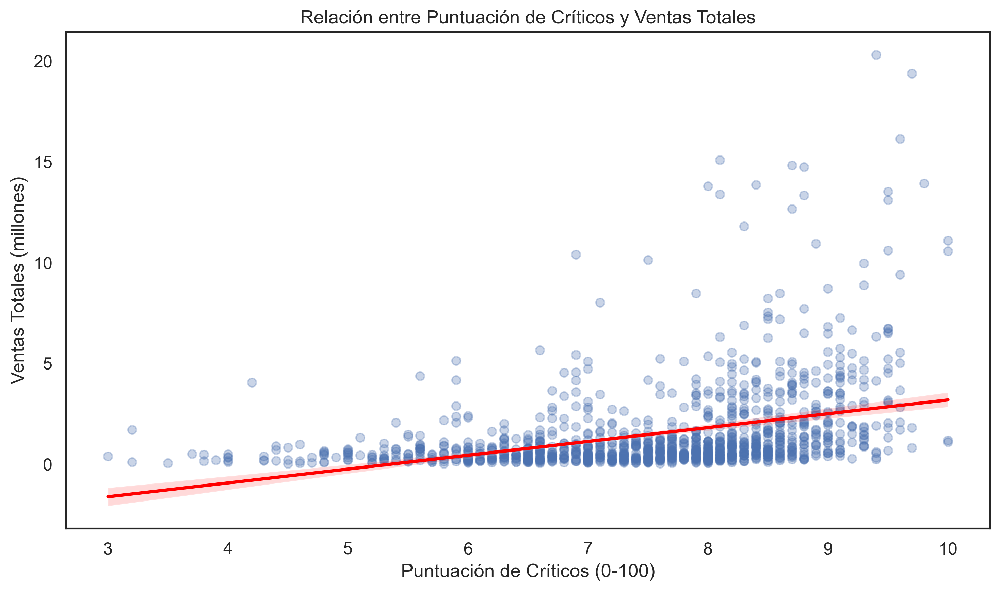

# Análisis de Datos de la Industria de Videojuegos

## 📌 Descripción del Proyecto

Este proyecto analiza datos de ventas de videojuegos a nivel mundial, explorando tendencias, patrones y relaciones entre diferentes variables como ventas por región, géneros, puntuaciones de críticos y más.

## 📊 Conjunto de Datos

- **Fuente**: VGChartz - Video Game Sales 2024 - asaniczka - [https://www.kaggle.com/datasets/asaniczka/video-game-sales-2024?resource=download ](https://www.kaggle.com/datasets/asaniczka/video-game-sales-2024?resource=download)
- **Período**: Hasta 2024
- **Archivo**: `vgchartz-2024.csv`
- **Número de registros**: [Número total de juegos]
- **Variables principales**:
  - Título del juego
  - Consola
  - Género
  - Editor
  - Desarrollador
  - Puntuación de críticos
  - Ventas por región (NA, JP, PAL, Otras)
  - Ventas totales
  - Fecha de lanzamiento

## 🛠️ Tecnologías Utilizadas

- Python 3.x
- Bibliotecas principales:
  - Pandas
  - Matplotlib
  - Seaborn
  - Jupyter Notebook

## 👥 Autores

- **Juan Camilo Cuenca Sepúlveda.**
- **Diego Alexander Jiménez.**

# 📊 Análisis de Datos de Videojuegos

## 📌 Preguntas Clave

### 1. ¿Cuáles son los 10 videojuegos más vendidos globalmente?

### 2. ¿Cómo ha evolucionado la industria de los videojuegos por año según las ventas?

### 3. ¿Cuáles son los géneros más populares y cómo se distribuyen sus ventas?

### 4. ¿Qué plataformas tienen más juegos en el top de ventas?

### 5. ¿Existe una relación entre la puntuación de los críticos y las ventas totales?
